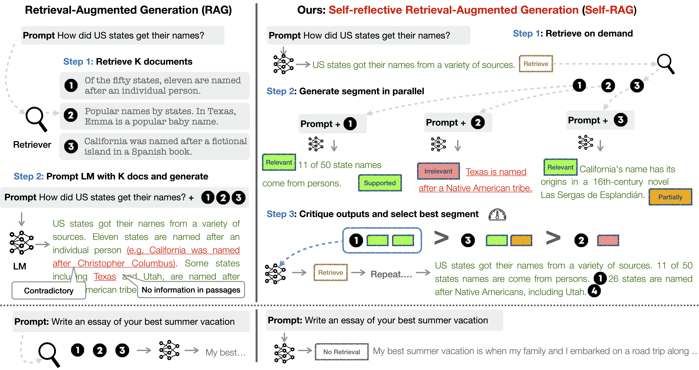

# SELF-RAG: Learning to Retrieve, Generate and Critique through Self-reflection

This includes the original implementation of [SELF-RAG: Learning to Retrieve, Generate and Critique through self-reflection](https://arxiv.org/abs/2310.11511) by Akari Asai, Zeqiu Wu, Yizhong Wang, Avirup Sil, and Hannaneh Hajishirzi. 

[Website](https://selfrag.github.io/) | [7B Model](https://huggingface.co/selfrag/selfrag_llama2_7b) | [13B Model](https://huggingface.co/selfrag/selfrag_llama2_13b) | [Paper](https://akariasai.github.io/files/adaptive_retrieval_augmented_lm_arxiv.pdf) | [Updates](#updates)

**Self-RAG** (Figure right) is a new framework to train an arbitrary LM to learn to retrieve, generate, and critique to enhance factuality and quality of generations, without hurting versatility of LLMs. 

Unlike a widely-adopted Retrieval-Augmented Generation (RAG; Figure left) approach, **Self-RAG** retrieves on demand (e.g., can retrieve multiple times or completely skip retrieval) given diverse queries, and criticize its own generation from multiple fine-grained aspects by predicting **reflection tokens** as an integral part of generation. 
We conduct a segment-wise beam search to select the output that maximizes the utility for diverse preferences. 





If you find our code, data, models, or the paper useful, please cite the paper:
```
@article{asai2023selfrag,
  author    = {Asai, Akari and Wu, Zeqiu and Wang, Yizhong and Sil, Avirup and Hajishirzi, Hannaneh},
  title     = {{Self-RAG}: Learning to Retrieve, Generate, and Critique through Self-Reflection},
  year      = {2023},
journal={ arXiv preprint arXiv:2310.11511 },
    url={https://arxiv.org/abs/2310.11511}
}
```

## Updates 
- **2023.10**: Initial release of codes, models, and the paper. 

## Content 
1. [Installation](#installation)
2. [Quick Start](#quick-start)
2. [Retriever setup](#retriever-setup)
3. [Training](#training) 
4. [Inference](#inference)
5. [Contact](#contact)


## Installation
Install dependent Python libraries by running the command below.

```
pip install -r requirements.txt
```
Please use the latest version of `vllm`, as the older version may not enable you to set `skip_special_tokens` via `SamplingParam`, which is added by ([this PR](https://github.com/vllm-project/vllm/issues/893)). 

## Quick start
You can download Self-RAG from HuggingFace Hub. For inference, we recommend using [vllm](https://vllm.readthedocs.io/en/latest/) as it significantly speed up inferences. 
 
```py
from transformers import AutoTokenizer, AutoModelForCausalLM
from vllm import LLM, SamplingParams

model = LLM("selfrag/selfrag_llama2_7b", download_dir="/gscratch/h2lab/akari/model_cache", dtype="half")
sampling_params = SamplingParams(temperature=0.0, top_p=1.0, max_tokens=100, skip_special_tokens=False)

def format_prompt(input, paragraph=None):
  prompt = "### Instruction:\n{0}\n\n### Response:\n".format(input)
  if paragraph is not None:
    prompt += "[Retrieval]<paragraph>{0}</paragraph>".format(paragraph)
  return prompt

query_1 = "Leave odd one out: twitter, instagram, what'sup."
query_2 = "Can you tell me the difference between llamas and alpacas?"
queries = [query_1, query_2]

# for a query that doesn't require retrieval
preds = model.generate([format_prompt(query) for query in queries], sampling_params)
for pred in preds:
  print("Model prediction: {0}".format(pred.outputs[0].text))
# Model prediction: Twitter, Instagram, and WhatsApp are all social media platforms.[No Retrieval]WhatsApp is the odd one out because it is a messaging app, while Twitter and # Instagram are primarily used for sharing photos and videos.[Utility:5]</s> (this query doesn't require factual grounding; just skip retrieval and do normal instruction-following generation)
# Model prediction: Sure![Retrieval]<paragraph> ... (this query requires factual grounding, call a retriever)

# for a query that needs factual grounding
prompt = format_prompt("Can you tell me the difference between llamas and alpacas?", "The alpaca (Lama pacos) is a species of South American camelid mammal. It is similar to, and often confused with, the llama. Alpacas are considerably smaller than llamas, and unlike llamas, they were not bred to be working animals, but were bred specifically for their fiber.")
preds = model.generate([prompt], sampling_params)
print([pred.outputs[0].text for pred in preds])
# ['[Relevant]Alpacas are considerably smaller than llamas, and unlike llamas, they were not bred to be working animals, but were bred specifically for their fiber.[Fully supported][Utility:5]</s>']
```

For a full evaluation, you either need to set up a retriever or download our retrieved results. Please follow instructions at [Inference](#instruction).  


## Retriever Setup
By default, we use [Contriever](https://github.com/facebookresearch/contriever) as our retrieval component. 

### Download data
Download preprocessed passage data used in DPR. 
```
cd retrieval_lm
wget https://dl.fbaipublicfiles.com/dpr/wikipedia_split/psgs_w100.tsv.gz
```

Then download the generated passages. We use [Contriever-MSMARCO](https://huggingface.co/facebook/contriever-msmarco) 
```
wget https://dl.fbaipublicfiles.com/contriever/embeddings/contriever-msmarco/wikipedia_embeddings.tar
```

### Run retriever
You can run passage retrieval by running the command below. 

```
cd retrieval_lm
python passage_retrieval.py \
    --model_name_or_path facebook/contriever-msmarco --passages psgs_w100.tsv \
    --passages_embeddings "wikipedia_embeddings/*" \
    --data YOUR_INPUT_FILE  \
    --output_dir YOUR_OUTPUT_FILE \
    --n_docs 20
```
Your input file should be either a `json` or `jsonl`. Each instance must contains either `question` or `instruction`, which will be used as a query during retrieval. 


## Training
**Self-RAG** trains two models, *Critic* and *Generator*, both of which expand token vocabularies with reflection tokens and are trained with the standard next token prediction objective. 

- [Step 1: Critic Data Creation](#collect-reflection-tokens): Generating Critic training data with GPT4. 
- [Step 2: Critic Training](#critic-training): Generating Critic training data with GPT4. 
- [Step 3: Generator Data Creation](#generator-data-creation): Generating Generator training data using Critic and Retriever. 
- [Step 4: Generator Training](#generator-training): Training a Critic / Generator with new special tokens. 

Alternatively, you can download our training data consisting of 150K instances [here](https://drive.google.com/file/d/10G_FozUV4u27EX0NjwVe-3YMUMeTwuLk/view?usp=share_link).

### Collect reflection tokens
We collect training data from GPT-4. The script to call GPT-4 for each special token types are available at [data_creation/critic](data_creation/critic). 

Alternatively, you can download our training data at HuggingFace dataset [here](https://drive.google.com/file/d/1IN1XcIOYtRIGWITJ4LKRgfITT-uUwk_W/view?usp=share_link). 

### Critic training
Once you create or download training data, run the command below to fine-tune Llama2-7B on critic training.  
```
cd data_creation
torchrun --nproc_per_node=2 \
  --master_port=2568 train_special_tokens.py \
  --model_name_or_path meta-llama/Llama-2-7b-hf \
  --data_path PATH_TO_TRAIN_DATA_FILE \
  --bf16  True \
  --output_dir PATH_TO_CRITIC_MODEL \
  --num_train_epochs 3  \
  --per_device_train_batch_size 1 --per_device_eval_batch_size 1 \
  --gradient_accumulation_steps 8 \
  --evaluation_strategy "no" \
  --save_strategy "steps" \
  --save_steps 300 \
  --save_total_limit 1 \
  --learning_rate 2e-5 \
  --weight_decay 0. \
  --warmup_ratio 0.01 \
  --lr_scheduler_type "cosine" \
  --logging_steps 10 \
  --fsdp "full_shard auto_wrap"
```

### Generator Data Creation
The code to create Generator training data is under [generator_data_creation](data_creation/generator). See the instructions at [README.md](data_creation/generator/README.md). 

Alternatively, you can download our training data at [HuggingFace dataset](https://huggingface.co/datasets/selfrag/selfrag_train_data/tree/main) or [here](https://drive.google.com/file/d/10G_FozUV4u27EX0NjwVe-3YMUMeTwuLk/view?usp=share_link)


### Generator Training
For generator training, we use DeepSpeed to make training more efficient. You can run training by running the script below, after setting the training data path. 

```
cd retrieval_lm
bash script_finetune_7b.sh
```
For 13B model training, use `training_13b`. We use 8 A100 with 40 GRAM for 7B model training and 4 a100 with 80 GB GRAM for 13B training. 7B should fit 1-2 A100 although training can be slow.  

## Inference 
For the task evaluation conducted in the paper, please download the data [here](https://drive.google.com/file/d/1TLKhWjez63H4uBtgCxyoyJsZi-IMgnDb/view?usp=share_link). 

Each file already comes with retrieved documents, so if you don't want to run retriever as a part of inference, you can simply load the retrieved docs at `contexts`. 

Below, we describe Self-RAG and baselines. 
- [Short-form](#shot_form): run evaluation for short-form generation. 
- [Long-form](#long_form): run evaluations for long-form generations. 

### Short-form (PubHealth, ARC-Challenge, TriviaQA, PopQA)
As we typically retrieve only once for a short-form generation task, we provide an easy-to-run evaluation script that leverages pre-given documents retrieved by Contriever offline. See the individual command below. 

#### Question Answering

```
python run_short_form.py \
--model_name selfrag/selfrag_llama2_7b \
--input_file eval_data/popqa_longtail_w_gs.jsonl \
--mode MODE --max_new_tokens 100 \
--threshold 0.2 \
--result_fp YOUR_OUTPUT_FILE \
--metric match --top_n 10 --use_groundness --use_utility --use_seqscore \
--dtype half
```

`mode` specifies the inference time mode among `['adaptive_retrieval', 'no_retrieval', 'always_retrieve']`. 

- `adaptive_retrieval` retrieves given the `threshold` or Self-RAG prediction
- `no_retrieval` disable retrieval at inference time
- `always_retrieve` always retrieves. 

For 13B, you may have OOM issue if you use single GPU with 24 GRAM. You can run inference on multiple GPUs by setting `--world_size`.  

#### ARC Challenge
```
python run_short_form.py \
  --model_name selfrag/selfrag_llama2_7b \
  --input_file eval_data/arc_challenge_processed.jsonl \
  --max_new_tokens 50 --threshold 0.2 \
  --result_fp OUTPUT_FILE_NAME \
  --metric match --top_n 5 --use_groundness --use_utility --use_seqscore \
  --task arc_c
```

#### PubHealth
```
python run_short_form.py \
  --model_name selfrag/selfrag_llama2_7b \
  --input_file eval_data/health_claims_processed.jsonl \
  --max_new_tokens 50 \
  --threshold 0.2 --result_fp OUTPUT_FILE_NAME \
  --metric match --top_n 5 \
  --use_groundness --use_utility --use_seqscore \
  --task fever
```

### Long-form (ASQA, FactScore)
For long-form QA, you can either run evaluation with retrieval model or run it with pre-given passages. 
Currently we are working on reducing run-time memory requirements (DPR / Contriever) with the whole English Wikipedia requires 100 GB RAM) and speeding up for long-form generations, and released the inference code using small set of initial retrieved documents first (~20). 

*Note: Our current implementation is specifically designed for evaluation on target task datasets. We are planning to update our code base to make interface more simple and easier to use. We will announce it when we release another version.* 

#### Run inference using pre-retrieved passages

For ASQA, please run the following command, 
```
python run_long_form_static.py.py \
  --model_name selfrag/selfrag_llama2_7b \
  --n_docs 5 --max_new_tokens 300 --threshold 0.2 \
  --use_grounding --use_utility --use_seqscore \
  --task asqa --input_file eval_data/asqa_eval_gtr_top100.json \
  --output_file YOUR_OUTPUT_FILE_NAME --max_depth 7 mode always_retrieve \
```

For FactScore, 

```
python run_long_form_static.py.py \
  --model_name selfrag/selfrag_llama2_7b \
  --n_docs 5 --max_new_tokens 300 --threshold 0.2 \
  --use_grounding --use_utility --use_seqscore \
  --task factscore --input_file eval_data/factscore_unlabeled_alpaca_13b_retrieval.jsonl \
  --output_file YOUR_OUTPUT_FILE_NAME --max_depth 7 \
```

##### Key parameters for long-form generations 
There are several key parameters related to the inference of Self-RAG. 
- `w_rel` (default 1.0): `w_rel` controls the emphasis on the `isRel` (a critique token on whether retrieved passages are relevant or not) token probability during beam search.
- `w_sup` (default 1.0): `w_sup` controls the emphasis on the `isSup` (a critique token on whether the generation is supported by the document or not) token probability during beam search.
- `w_use` (default 0.5): `w_use` controls the emphasis on the `isUse` (a critique token on overall quality) token probability during beam search.
- `threshold` (default 0.2): this threshold controls the frequency of adaptive retrieval.
- `max_depth` (default 6): this corresponds to `T` in the paper, which defines the maximum depth of search.
- `beam_width` (default 2): this controls the size of the beam in the segment-level beam search. 

For more details, please refer to the details (Section 3.3) and analysis (Section 5) in our paper.  

#### Run evaluation
For long-form evaluations, set up external libraries or repositories to run evaluations. 

- `factscore==v0.1.5` (bio)
Please follow the instructions at the [FactScore](https://github.com/shmsw25/FActScore) official repository to set up your environment. 
```
python -m factscore.factscorer --data_path YOUR_OUTPUT_FILE  --model_name retrieval+ChatGPT --cache_dir YOUR_CACHE_DIR --openai_key YOUR_OPEN_AI_KEY --verbose
```

- [ALCE/ASQA](https://github.com/princeton-nlp/ALCE)

ALCE provides a comprehensive evaluation using multiple different metrics for long-form QA. For your first evaluation, install the ALCE repo and download the data. 
```
git clone https://github.com/princeton-nlp/ALCE.git
python3 -m alce_env
cd ALCE
bash download_data.sh
```

For ASQA, you can run evaluations as follows. Note that ASQA evaluations require T5-XXL (11B)-based NLI module. 
```
python eval.py --f YOUR_OUTPUT_FILE --citations --qa --mauve
```

## Contact
If you have questions, please open an issue mentioning @AkariAsai or send an email to akari[at]cs.washington.edu. 
